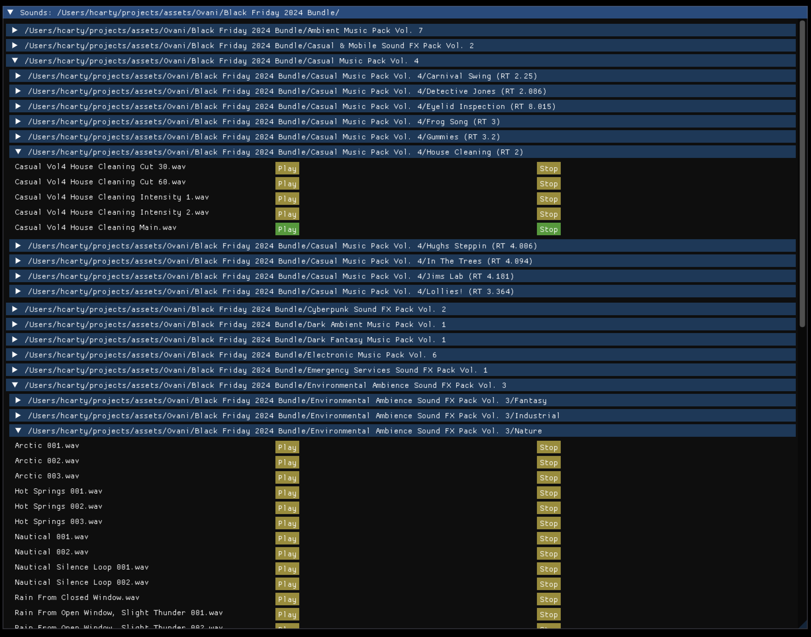

# A simple sound and music browser

A very small, simple, minimal audio browser using the [orx game engine](https://orx-project.org/) and [dear imgui](https://github.com/ocornut/imgui).

The project is released under the [MIT licensed](LICENSE.txt)

## Usage

You need to have orx built and configured on your system. There are not currently any pre-built binaries for this application.

The quickest and simplest approach is to modify [soundmanager.ini](data/config/soundmanager.ini) to set the `Root` key under `[AllSounds]` to the full path to your sound and/or music directory. `FormatList` defines the file extensions to include in the browser. It can be extended to include other file extensions such as `ogg` and `mp3`.

You can also create multiple browser windows, each pointing to different paths and/or file formats. A config section that inherits from `Browser` defines a browser window object and can specify a `Root` path and `FormatList` of file extensions. Add each window you want to open on program startup to the `ChildList` in the `[Scene]` section.

## Why orx and dear imgui?

Part of the answer is that orx is a lot of fun to use! Finding audio, loading sounds, and playing them back is all done with orx. The application code is otherwise mostly UI. dear imgui makes that quite easy to write.

Some highlights of using orx for this project:

- Searching for supported files on disk is done with the file system wrapper functions from orx
- Sounds/music are loaded by generating object config pointing to each audio file found on disk
- Sounds are loaded and played by creating objects from these sections
- Similarly, play/stop controls use the object sound control functions
- Finally, object life times are linked to sound playback. The application will free audio objects automatically if they finish playing without being stopped manually. The engine handles this transparently without any explicit polling or explicit resource management.

My expectation before writing this application was that orx would make it simple to create. And it was as or more simple than I expected!
